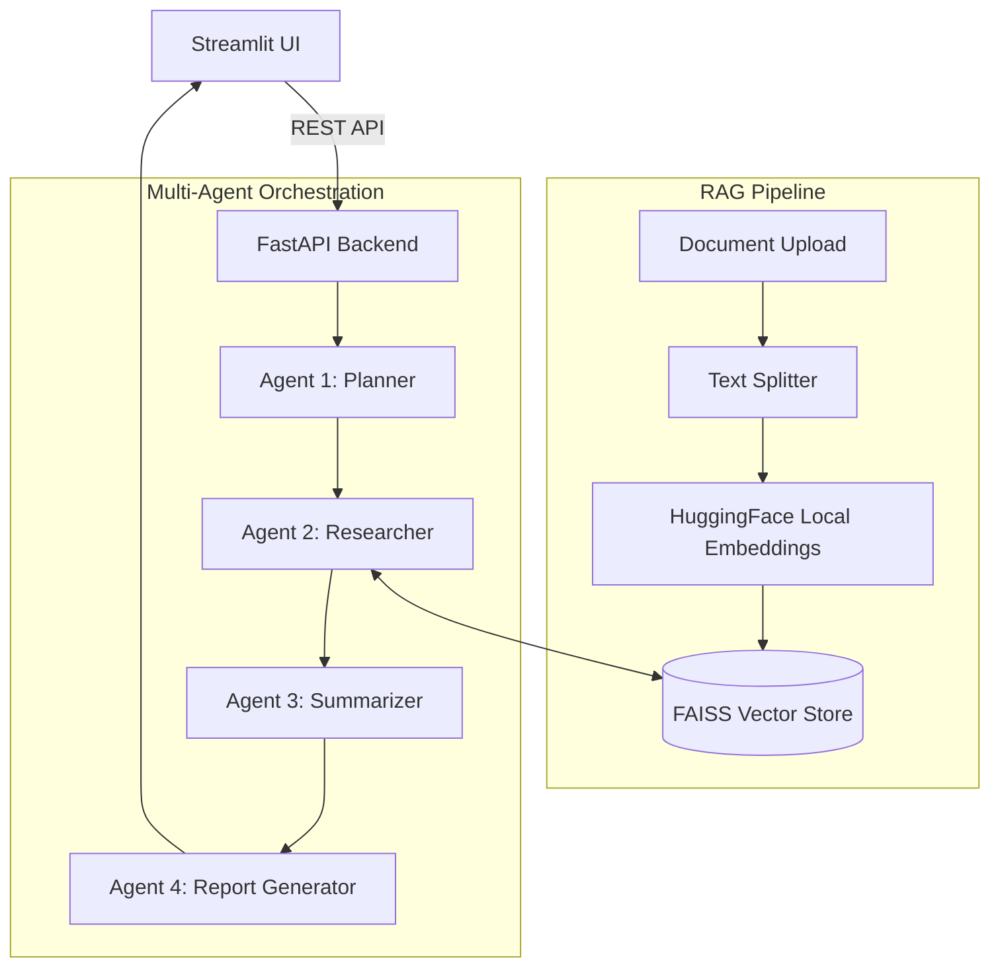

# 🔬 Multi-Agent Research Assistant

[](https://github.com/mvishnunaidu/multi-agent-research-assistant/actions/workflows/ci.yml)
[](https://www.python.org/downloads/)
[](https://opensource.org/licenses/MIT)

A full-stack, deploy-ready **Generative AI** application that acts as an intelligent cognitive engine for your documents. It uses a dynamic Multi-Agent Architecture to read, analyze, and synthesize insights from PDFs, DOCX, and TXT files.

Built with **Streamlit**, **Python**, **FastAPI**, **LangChain**, **FAISS**, and **HuggingFace**, this application completely replaces basic prompting by orchestrating four specialized AI agents to autonomously fulfill complex research tasks.

---

## 🏗️ Architecture Overview



### The 4-Agent Pipeline:
1. **Planner Agent:** Decomposes the user's initial prompt into an executable research strategy.
2. **Researcher Agent (RAG):** Connects to the FAISS vector database to retrieve semantically matching chunks from the uploaded documents using local Sentence Transformers.
3. **Summarizer Agent:** Condenses the retrieved text, filtering out noise and extracting core facts.
4. **Report Generator Agent:** Synthesizes the summarized context into a highly structured, professional answer.

---

## 💻 Tech Stack

### Frontend
* **Framework:** Streamlit
* **Styling:** Custom CSS

### Backend (AI & API)
* **API Framework:** FastAPI, Uvicorn, Pydantic
* **AI Orchestration:** LangChain
* **Vector Database:** FAISS
* **Embeddings:** HuggingFace `sentence-transformers` (runs entirely locally to eliminate embedding API costs)
* **LLMs Supported:** Gemini API (Default), OpenAI, Groq

---

## 🚀 Quick Start

### 1. Clone the repository
```bash
git clone https://github.com/mvishnunaidu/multi-agent-research-assistant.git
cd multi-agent-research-assistant
```

### 2. Backend Setup
Create a virtual environment and install dependencies:
```bash
python -m venv venv
venv\Scripts\activate  # Windows
pip install -r requirements.txt
```

Configure your environment variables:
```bash
cp .env.example .env
```
Open `.env` and add your chosen API key (e.g., `GEMINI_API_KEY=your_key_here`).

Start the Uvicorn server:
```bash
python -m uvicorn backend.main:app --reload --host 0.0.0.0 --port 8000
```

### 3. Frontend Setup
Open a second terminal:
```bash
streamlit run frontend/app.py
```
Navigate to `http://localhost:8501` in your browser.

---

## 📄 License
This project is licensed under the MIT License. Feel free to use, modify, and showcase it in your portfolio.
